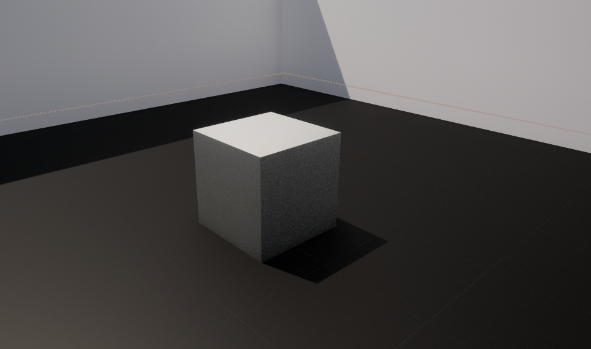

# GameProgramming-Exp01
## AIM:
To Implementing various effects in a material such as emissive, roughness and metallic properties in Unreal Engine

## Steps Required:
### Step-1:
Right click in the content browser and choose material
### Step-2:
Rename the material and double click to open it
### Step-3:
Right click in the working space and serach for constants
### Step-4:
In constant choose constant vector 4
### Step-5:
After this double click on the constant vector 4 and edit the color  using color picker
### Step-6:
After adjusting the color click okay and save it
### Step-7:
The join the output of the constant vector 4 to the base color
### Step-8:
Create a single constant using the step 3 and adjust the value of it using detail pannel by adjusting the value
### Step-9:
And you can apply this constant value to metallic,roughness,emmesive color etc...
### Step-10:
For emmesive you need multiply the constant vector 4 and constant and apply it to emmesive color
### Step-11:
For creating walls and gate you need to create a material and  import a png image .
### Step-12:
And use the png image as texture sample and  connect the (rgb) of texture sample to the emmisive color &   connect the alpha value of texture sample to the opacity 
### Step-13:
The save it,  go to the third person example map and create a plane or cube apply th material which you have created for the wall or gate

## Output:
### Basic-Color:

### Emmisive:

### Metallic:

### Roughness:
